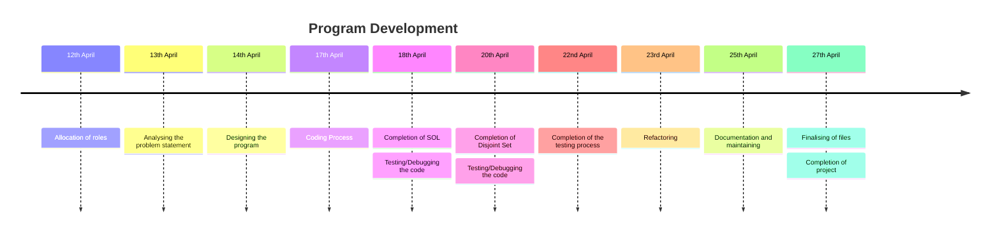

# DS-CIA-2
Problem Statement 6: "Disjoint Set ADT and Self-Organising List"

Welcome to our group project repository. This project focuses on designing and implementing two important data structures: "Disjoint Set" and "Self-Organising List".

## Overview
This repository contains the implementation of Disjoint Set ADT and Self-Organizing List in C/C++. Both data structures are fundamental in computer science and have various applications in different domains

## Contents

- `disjoint_set.cpp`: Implementation of Disjoint Set ADT.
- `self_organising_list.cpp`: Implementation of Self-Organizing List.
- `Self Organising List.txt`: Explanation for the use of "move to front" in SOL
- `Disjoint_set.pdf`: Explanation for the use of "trees" and "union by rank" in Disjoint Set
- `Self Organizing List - Test_cases.pdf`: Implementation of Functional testing by reviewing test cases.[Self Organising List]
- `Disjoint Set Test Cases`: Implementation of Functional testing by reviewing test cases.[Disjoint Set ADT]
  

## Contributors
Team Member's Details: [Name, Roll Number, Role]
	1. S Meghna 			- 23110528 - Project Manager
	2. S K Karisma 			- 23110270 - Business Analyst
	3. Nilanjana T 			- 23110104 - Tester
	4. Shravya K 			- 23110401 - Tester
	5. Swaathi B 			- 23110017 - Tester
	6. Pavithra Rajindra 		- 23110088 - Developer
	7. R Sai Sreya 			- 23110186 - Developer
	8. R G Samyuktha 		- 23110108 - Developer
	9. Sanjana S 			- 23110176 - Developer
	10. Pavithra T A 		- 23110412 - Developer

